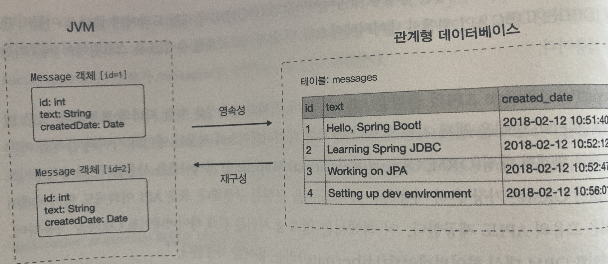

스프링 JDBC와 JPA
-

### JDBC

* JDBC(Java DataBase Connectivity의 줄임말) 드라이버는 특정 데이터 베이스에 대한 JBDC API 구현체이다. 예를 들어 com.mysql.jdbc.Driver 는 MYSQL 데이터베이스에 대한 드라이버 클래스의 이름이고 jdbcDriver는 순수 자바로 작성된 관계형 DB인 HSQLDB에 대한 클래스 이름
* 스프링 JDBC는 JDBC API 위에서 데이터베이스와 더 쉽게 사용작용할 수 있게함 

### JPA
* JPA(Java Persistence API의 줄임말). 
* JPA는 자바 객체의 영속성(사라지지 않음)을 위한 자바의 표준화된 접근 방식을 정의
* 객체 지향 모델과 관계형 데이터베이스에 저장된 데이터 사이의 간격을 메우기 위해 **객체 관계형 매핑(ORM, Object-Relational Mapping)** 메커니즘을 사용
* 하이버네이트 ORM은 가장 흔히 사용하는 JPA 표준을 구현한 구현체

### JDBC와 JPA
* JDBC와 JPA는 서로 다른 문제를 해결하는 두가지 API 세트
* JDBC API는 DB와의 상호작용을 해결하지만 JPA는 객체지향방식으로 DB에 객체를 저장하고 가져오는 방법을 담당. 즉, JPA 구현체는 JDBC 드라이버에 의존한다.



---

시작하기
-
* mysql 설치
<https://goddaehee.tistory.com/277/>

* DB 생성
```sql
CREATE DATABASE app_messages default CHARACTER SET UTF8;
SHOW databases;
USE app_messages;
```


pom.xml 에 아래와 같은 내용 추가
```html
<dependency>
    <groupId>org.springframework.boot</groupId>
    <artifactId>spring-boot-starter-jdbc</artifactId>
</dependency>
<!-- datasource의 인스턴스를 기동해서 스프링컨테이너에서 사용할 수 있도록 해주고, 커넥션 풀을 설정한다. -->

<dependency>
    <groupId>mysql</groupId>
    <artifactId>mysql-connector-java</artifactId>
</dependency>
<!-- jdbc 드라이버, 버전이 없는데 이는 부트 내부적으로 자동 처리하기 때문이다. -->
```


```java
PreparedStatement ps = c.prepareStatement(insertSql, Statement.RETURN_GENERATED_KEYS);
```
* Statement.RETURN_GENERATED_KEYS 코드를 통해서 insert 한 뒤 키 값이 필요하다는 명시를 해줄 수 있다.
* 그 키는 ps.getGeneratedKeys(); 를 통해 받아온다.

* c.close(); 를 통해 커넥션을 닫아야 커넥션 풀로 연결이 반환되고 그렇지 않으면 다른 연결에 의해 재사용 된다.
* 최종적으로 DataSourceUtils.releaseConnection(c, dataSource); 를 통해 연결을 반환했다.

