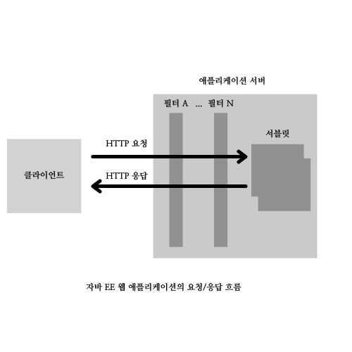

어플리케이션 서비스 과정
-
1. 빌드 (실행가능한 파일인 jar 나 war 로 묶음 / 이때 시작 지점인 main을 설정함)
2. was 내부에 파일을 배포
3. 실행
---
```html
<build>
    <finalName>messages</finalName><!--messages-jar-with-dependencies.jar 이라는 파일 생성-->
    <plugins>
        <plugin>
            <groupId>org.apache.maven.plugins</groupId><!-- 메이븐 플러그인 사용 -->
            <artifactId>maven-assembly-plugin</artifactId><!-- 식별자 -->
            <executions><!-- 실행옵션 -->
                <execution>
                    <phase>package</phase><!-- package 단계 실행 : 컴파일, 테스트, 빌드를 수행하여 패키지 파일(jar나 war 같은 실행가능한 파일)을 생성한다. -->
                    <goals><goal>single</goal></goals><!-- single jar 파일로 생성하기 위한 옵션이다. -->
                    <configuration>
                        <archiveBaseDirectory>${project.basedir}</archiveBaseDirectory>
                        <archive>
                            <manifest><mainClass>app.messages.Application</mainClass></manifest><!-- 메인 클래스 위치 -->
                        </archive>
                        <descriptorRefs>
                            <descriptorRef>jar-with-dependencies</descriptorRef><!-- 뒤에 붙는 이름 jar-with-dependencies -->
                        </descriptorRefs>
                    </configuration>
                </execution>
    
            </executions>
        </plugin>
    
    </plugins>
</build>
```
위 어플리케이션 실행하기
1. pom.xml에 위 설정을 넣기
2. 명령 프롬프트 에서 해당 프로젝트 루트로 찾아가기
3. mvn install (당연히 설치되어 있어야함)
4. target에 생긴 messages-jar-with-dependencies.jar 파일 실행 (java -jar 파일)
---

```java
1. @Component
2. @Service
3. @Controller
4. @Repository
```
1. 해당 클래스를 인스턴스화 한다. 스프링에서 의존성 주입이 가능한 상태(Bean)가 됨
2. @Component 어노테이션을 특수화 한 것. 
3. 컴포넌트가 HTTP 요청을 받을 수 있는 웹 컨트롤러임을 나타낸다.
4. 
---
### 의존성 주입을 연결하는 어노테이션과 3가지 방법
1. 생성자 이용 => Autowired
2. setter 이용 => Required
3. 필드 이용 => Autowired

**이 때 3번은 권장하지 않는 방법인데 이유는**
1. 의존성을 마음대로 변경할 수 있게 된다.
2. 의존성 정보를 숨기기 어렵다.
3. 단일 책임 원칙을 위반할 가능성이 있다.(하나의 객체는 하나의 책임만 져야한다.)

생성자를 통해서 의존성을 주입하는 경우 초기화 이후 읽기전용(readonly)이 되어서 아무도 그 의존성을 변경할 수 없다

---
## 자바 EE 서블릿
* 서블릭은 일반적으로 톰캣과 같은 애플리케이션 서버인 서블릿 컨테이너 내에서 작동
* HTTP 요청이 도착하면 일반적으로 인증,로깅,감사와 같은 필터링 작업을 수행하는 필터 리스트를 통과함
* 필터를 모두 통과하면 애플리케이션 서버는 특정 패턴과 일치하는 (URL을 포함하는 요청을 처리할 수 있게 등록된) 서블릿으로 요청을 넘겨준다.
* 처리를 마치면 다시 같은 필터 세트를 통과한 후 클라이언트로 다시 전송된다.


---

* 자바 EE에서 모든 HTTP 요청에 대해 HttpServletRequest 인스턴스가 생성되고 응답에 대해 HttpServletResponse 인스턴스가 생성된다.
* **사용자를 식별하기 위해 애플리케이션 서버는 ~~첫 번째 요청~~을 받으면 HttpSession 인스턴스를 생성한다.
각 HttpSession 인스턴스는 세션 ID 라고 부르는 ID를 가진다. 그리고 세션 id는 HTTP 응답 해더의 클라이언트에 쿠키로 전송된다. 클라이언트는 그 쿠키를 저장하고 다음 요청시에 다시 서버로 보내고 그 아이디를 통해 서버는 클라이언트를 식별한다.

-> 그래서 로그인을 한 뒤에 개발자 도구에서 쿠키를 모두 삭제하면 로그인이 풀리는 것이다.

---

* 자바 EE에서 **HttpSessionListener** 인터페이스를 구현해 HttpSession의 라이프 사이클 이벤트를 수신하거나 ServletRequestListener 인터페이스를 구현해 요청에 대한 라이프 사이클 이벤트를 수신하는 리스너를 만들수 있다.
* 서블릿을 생성하기 위해 javax.servlet.http.HttpServlet을 확장하고 @WebServlet 어노테이션을 적용하거나 web.xml 을 통해서 등록하여 요청을 받을 수 있다.

또한 서블릿에선 다음 메소드를 재정의 할 수 있다.

* doGet
* doPost
* doPut
* doDelete

각각, 들어온 요청을 처리한다.

---
DispatcherServlet
-

스프링 MVC의 경우 별도의 서블릿을 생성할 필요가 없다.
스프링은 요청을 받기 위해, 핵심 서블릿인 DispatcherServlet을 활용한다.
DispatcherServlet은 요청을 처리할 수 있게 설정되어야 하며, @RequestMapping 어노테이션에 지정된 URL 패턴에 따라 요청을 처리할 컨트롤러를 찾는다.

