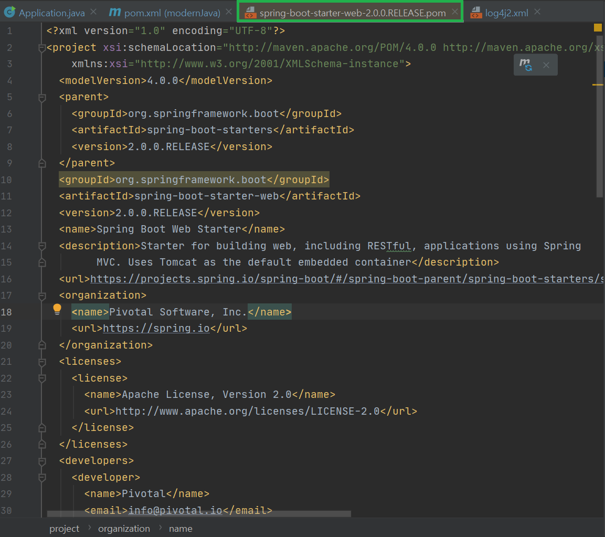
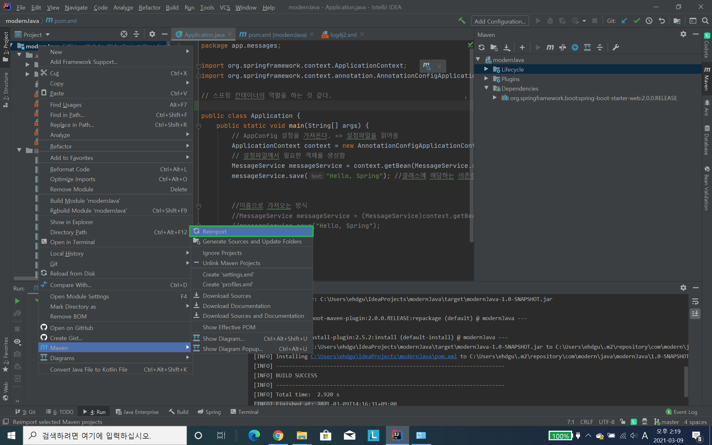
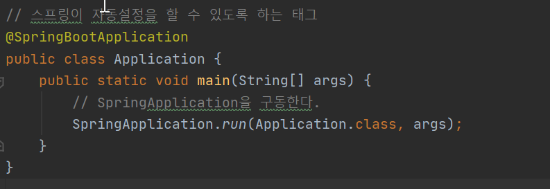
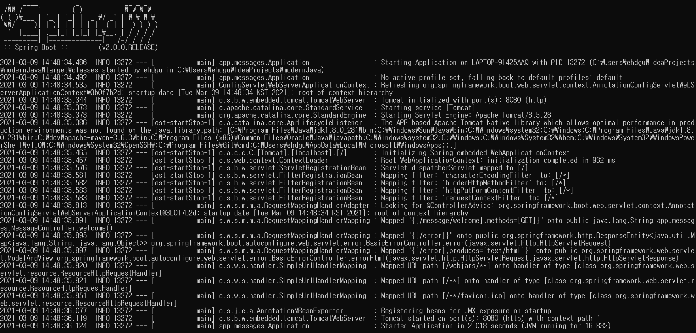

SpringBoot 시작
-
```html
<dependency>
    <groupId>org.springframework.boot</groupId>
    <artifactId>spring-boot-starter-web</artifactId>
</dependency>

<dependencies>
    <dependency>
        <groupId>org.springframework.boot</groupId>
        <artifactId>spring-boot-starter-web</artifactId>
    </dependency>
</dependencies>
```
위 코드를 추가한 뒤에 메이븐 install 하면 된다.


* pom.xml 의 수정사항은 idea 가 자동으로 다운받아 주긴 하지만, 기본적으로 직접 maven을 이용해서 설치 명령을 내릴 수도 있다.
* <parent> 태그는 부모의 스타터로부터 프로젝트 아티팩트를 상속받는다. 그리고 spring-boot-starter-web 의존성은 spring-context 모듈을 포함한다.


스프링 부트가 관리하고 있는 의존성들


스프링 프레임워크를 부트로 변경하면 다시 import 해줘야 한다.


스프링 부트 시작 


스프링 부트 컨트롤러 생성

```html
<plugins>
    <plugin>
        <groupId>org.springframework.boot</groupId>
        <artifactId>spring-boot-maven-plugin</artifactId>
    </plugin>
</plugins>
```
으로 플러그인을 변경해준다.


1. mvn spring-boot:run 으로 부트가 자동으로 어플리케이션 실행하도록 함
2. ctrl + c 로 어플 종료

---

# 어노테이션
 * @ResponseBody 
    - 리턴 타입이 경로가 아닌, Stream을 타고 나갈 수 있도록 설정함. 원래는 HttpServletResponse 객체를 통해 얻은 스트림으로 해야하는 동작을 프레임워크단에서 처리해줌
    - 응답의 반환값을 본문으로 사용하는 효과를 줌
 * @RequestMapping
    - 요청을 컨트롤러가 받을 수 있도록 매핑을 생성해준다.
 * @Controller
    - 이 클래스가 컨트롤러임을 알린다. 
 * @GetMapping("url")
    - @RequestMapping(value="url", method=RequestMethod.GET) 의 축약형이다. post, delete, put 도 동일
 * RestController
    - RESTful API 를 만들기 위해 사용하는 컨트롤러로 @Controller와 @ResponseBody의 조합이다.
 
 
 ---

html 템플릿 엔진 추가하기
-
 
 ```html
<!-- 정의한 HTML 템플릿 기반으로 HTML 코드 생성하는 템플릿 엔진을 추가 / 직접 라이브러리를 추가하는 것이 아닌 부트가 할 수 있도록 -->
<dependency>
 <groupId>org.springframework.boot</groupId>
 <artifactId>spring-boot-starter-thymeleaf</artifactId>
</dependency>
 ```
src/main/resources 밑에 디렉토리인 templates 추가 하면
Controller의 return 타입의 파일은 해당 디렉토리 안에서 찾는다.
---

ModelAndView 사용하기
```java
@GetMapping("/welcome")
public String welcome(Model model) {
    model.addAttribute("message", "Hello, Welcome to Spring Boot!");
    return "welcome";
}

@GetMapping("/welcome")
public ModelAndView welcome() {
    ModelAndView mv = new ModelAndView("welcome");
    mv.addObject("message", "Hello, Welcome to Spring Boot!");
    return mv;
}
```

위와 아래는 완전히 동일한 코드이다. 
스프링은 HTML 템플릿 엔진인
1. JSP (스프링 부트가 임베디드[컴퓨터 시스템에 내장하는] 서버로 실행이 될 때는 많은 제약이 있어서 jsp 사용을 피하는 것이 좋다.)
2. 그루비 마크업
3. 프리마커
4. 머스태시 
5. 밸로시티(추가작업 후 연동 가능)
등등 을 지원한다.

---

필터
-
* 필터는 자바 EE 의 또 다른 좋은 기술
* 이 필터는 디자인 패턴인 **책임 연쇄 패턴(Chain of Responsibility)을 구현한 것.
* 서블릿에 도달하기 전에 작동한다.
* 필터를 만드려면 javax.serlvet.Filter 인터페이스를 구현하여야 한다.

```java
public class AuditingFilter extends GenericFilterBean {

    @Override
    public void doFilter(ServletRequest req, ServletResponse res, FilterChain chain) 
            throws IOException, ServletException {
        long start = new Date().getTime();
        chain.doFilter(req, res);
        long elapsed = new Date().getTime() - start;
        
        HttpServletRequest request = (HttpServletRequest) req;
        logger.debug("Request[url=" + request.getRequestURI() + 
                ", method=" + ((HttpServletRequest) req).getMethod() + 
                " completed in " + elapsed + " ms");
    }
}
```
* GenericFilterBean 을 상속받아야 함
* chain.doFilter(req, res)
    - 체인에 필터가 존재하면 추가 필터를 호출 할 수 있도록 함. 이 후 서블릿을 호출한다.
    - doFilter 를 호출하지 않으면 클라이언트에 응답을 보낼 수 없다. 호출했지만 필터를 등록하지 않았다면 마찬가지로 응답을 보낼 수 없다.
    - 또한 doFilter 를 호출한 이후 추가 작업을 진행할 수 있다.
    

필터를 등록하는 두가지 방법
-
1. web.xml 파일에 <filter-mapping>을 추가해서 등록하는 방법 => 이는 웹 애플리케이션이 실행될 때 사용하는 방법이다.(war로 묶어서 사용할 때)
2. FilterRegistrationBean을 만들어 설정파일인 AppConfig 에 등록하는 방법 (톰캣을 임베디드로 실행할 때 적합)

필터 등록하기(AppConfig)
-
```java
@Configuration
public class AppConfig {
    @Bean
    public FilterRegistrationBean<AuditingFilter> auditingFilterFilterRegistrationBean() {
        FilterRegistrationBean<AuditingFilter> registration = new FilterRegistrationBean<>();

        AuditingFilter filter = new AuditingFilter();
        registration.setFilter(filter);
        registration.setOrder(Integer.MAX_VALUE);
        registration.setUrlPatterns(Arrays.asList("/messages/*"));
        return registration;
    }

}
```
* AuditingFilter 타입을 제네릭으로 하는 FilterRegistrationBean을 생성한다.
* 만든 필터를 생성 후 필터 등록 객체에 등록한다.
* @Configurable 과 @ComponentScan("app.messages") 어노테이션 대신 @Configuration 사용


필터의 디버그 결과를 로그로 관리하기
-
1. resources 아래 application.properties 파일 생성
2. logging.level.app.filter.AuditingFilter=DEBUG 추가 이 때 app.filter.AuditingFilter 는 경로와 필터의 이름이다.
---

필터의 구동 과정
-
    ① 서블릿 컨테이너는 웹 어플리케이션을 시작할 때 DD파일(web.xml)에 등록된 필터의 인스턴스를 생성하고 init()을 호출한다.  
    ② 클라이언트 요청이 들어오면 해당하는 필터의 doFilter()를 호출한다.  
    ③ doFilter()에서 작업을 실행하고 다음 필터의 doFilter()를 호출한다.  
    ④ 마지막 필터까지 ③을 반복한다.  
    ⑤ 마지막 필터는 서블릿의 service()를 호출한다.  
    ⑥ 서블릿의 service()가 끝나면 service()를 호출했던 이전 필터로 돌아간다.  
    ⑦ 반복해서 제일 처음 호출됐던 필터까지 돌아간다.  
    ⑧ 마지막으로 클라이언트에게 응답 결과를 보낸다.  


