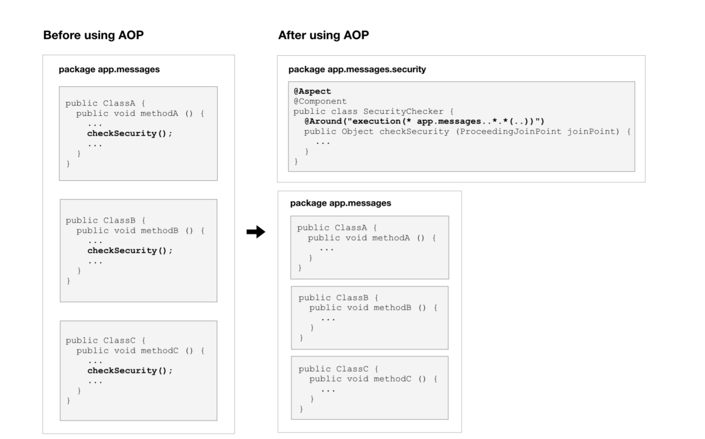

스프링 AOP
-
보안 검사를 컨트롤러 중간에 놓는 것은 옳지 않다.  
왜냐하면, 수십~수백개에 달하는 컨트롤러에 중복된 코드를 사용하게 되기 때문이다.   
따라서 보안 검사는 중앙에서 담당하는 것이 옳다.  
중앙에서 담당한다면, API핸들러(여기선 컨트롤러)에 도달했을 때 부턴 더이상 보안에 대해 걱정하지 않아도 된다.

참고 : 
* 보안 검사를 수행하는데에는 몇가지 유형이 있다.
   1. 특정 IP 주소에서 오는 요청만 허용하는 방법
   2. 코드에 자격증명하는 코드를 하드코딩하는 방법
   3. 클라이언트 측에서 자격증명을 요청한 헤더에 포함시키게 하는 방법(Authorization 헤더)

왜 AOP를 사용해야하는가?
-
요청에 대해 보안 검사를 담당하는 SecurityFilter를 생성할 수 있다.  
이는 필터 내부에서 request.getRequestURI()와 request.getMethod로 요청이 어떤 API를 대상으로 하는 것인지 파악한 후 승인하는 방법이다.  
허나 이는 **요청을 처리하는 단계에서 보안검사를 원할 때만** 완벽하게 작동한다. 

복잡한 애플리케이션의 경우 메소드 단계에서 보안검사를 수행하기 원할 수 있다.  
이 경우 Filter 에서 넣어놓은 보안은 작동하지 않을 것이다.  
AOP는 OOP와 비교했을 때 애플리케이션 구조를 바라보는 또 다른 관점이라고 할 수 있다.  


관심사란?
-
어플리케이션이 충족해야하는 목표 중 하나
AOP에서 보안 검사는 보안에 관련된 관심사(Concerns) 이다.  
어플리케이션에서 관심사의 유형으로는 성능로깅, 트랜젝션 관리 등등이 있다.

애스팩트(Aspects)란?
-
애스팩트는 관심사들을 모듈화 한 것이다.  
여러 클래스에 걸쳐 코드를 분산하는 대신에 관심사를 다루는 로직을 하나의 애스팩트에 넣는다.   
스프링 AOP에서는 일반 클래스에 애스팩트를 구현 한 뒤에 AspectJ 라이브러리의 어노테이션인 @Aspect 를 적용하면 애스팩트가 된다.

ClassA의 methodA(), ClassB의 methodB(), ClassC의 methodC()가 있고 이 메소드 내부에서 보안검사가 필요하다고 가정하자.   
AOP 사용전에는 모든 메소드에 보안 검사를 처리하는 코드를 추가해야하나 AOP를 이용하면 보안검사로직을 자바 일반 클래스인 SecurityChecker 애스펙트로에서 해당 메소드를 뽑아내면 된다.  
그리고 이 클래스 내부에서 @Around 어노테이션을 추가해서 보안을 실행하는 시점을 지정할 수 있다.

구조도는 아래와 같다.


---

조인 포인트
-
AOP 에서 조인포인트(Join Points)는 특정 프로그램이 실행되는 지점이다.
여기서는 methodA(), methodB(), methodC() 가 그 지점에 해당된다.
AspectJ와 같은 AOP 다른 구현체는 필드 접근과 예외 발생에 대한 조인포인트도 지원한다.


어드바이스
-
AOP에서 AspectJ 구현체 내부의 check 메소드는 어드바이스(Advices) 라고 부른다.  
어드바이스는 특정 관심사를 처리하는 행동이다.  
다음과 같은 다양한 유형의 어드바이스가 있다.

* Before advice(이전): 조인 포인트 이전에 실행되는 어드바이스. 예외를 던지지 않는 한, 조인포인트에 도달하는 코드 실행을 막을 수는 없다.
   - @Before 어노테이션
* After(이후): 조인포인트 실행 후
   - @After
* After returning advice(정상적 반환 이후): 예외를 던지지 않고 조인 포인트가 정상적으로 완료된 후 실행되는 어드바이스.
   - @AfterReturning 어노테이션
* After throwing advice(예외 발생 이후): 예외를 던져 메소드가 종료될 때 실행되는 어드바이스.
   - @AfterThrowing 어노테이션
* After Advice(이후): 조인 포인트 실행과 관계 없이 실행되는 어드바이스. 이것은 try ...catch의 final 블록과 같다.
   - @After 어노테이션
* Around Advice(메소드 실행 전후): 조인 포인트를 둘러싼 어드바이스. 이 유형의 어드바이스는 코드 실행을 완전히 제어하므로 가장 강력하다.
   - @Around 어노테이션
   
시작하기
-
1. pom.xml에 명시해주기
```html
<!-- 스프링 부트 aop -->
<dependency>
    <groupId>org.springframework.boot</groupId>
    <artifactId>spring-boot-starter-aop</artifactId>
</dependency>
```

2. 어노테이션 추가
```java
@Aspect
@Component
public class SecurityChecker {
    private static final Logger logger = LoggerFactory.getLogger(SecurityChecker.class);
}
```
관리해줄 클래스를 위와 같이 생성

3. 각각의 시점을 정하기
```java
@Around("execution(* app.messages..*.welcome(..))")
public Object Around(ProceedingJoinPoint joinPoint) throws Throwable {
    logger.debug("Around Start");
    Object response = null;
        try {
            response = joinPoint.proceed();
        } catch (Throwable e) {
            e.printStackTrace();
        }
    logger.debug("Around End");
    return response;
}
@After("execution(* app.messages.MessageController.welcome(..))")
public void After(JoinPoint joinPoint) {
    logger.debug(joinPoint.getSignature().getName() + " After");
    // ProceedingJoinPoint joinPoint 는 오직 Around 어노테이션에만 적용할 수 있다.
}

@AfterReturning("execution(* app.messages.MessageController.welcome(..))")
public void AfterReturning(JoinPoint joinPoint) {
    logger.debug(joinPoint.getSignature().getName() + " AfterReturning");
    // ProceedingJoinPoint joinPoint 는 오직 Around 어노테이션에만 적용할 수 있다.

}

@AfterThrowing(value="execution(* app.messages.MessageController.welcome(..))", throwing = "e")
public void AfterThrowing(JoinPoint joinPoint, Exception e) {
    logger.debug(joinPoint.getSignature().getName() + " AfterThrowing");
    logger.debug(e.getMessage());
}
```
* 에러가 발생했을 때 
   - Around Start
   - welcome - 컨트롤러
   - Around End
   - welcome After
   - welcome AfterThrowing

* 에러가 발생하지 않았을 때 
   - Around Start
   - welcome - 컨트롤러
   - Around End
   - welcome After
   - welcome AfterReturning

* AfterThrowing 의 경우 Exception 관리를 해야하는데 이럴 때 어노테이션에 속성값을 줘야하는데 아래와 같이 주면 된다
   - @AfterThrowing(value="execution(* app.messages.MessageController.welcome(..))", throwing = "e")
   - 그리고 이것을 AfterThrowing(JoinPoint joinPoint, Exception e) 이런식으로 인자로 받아 사용하면 된다.
   

참고사항 
-
* Around 어노테이션은 생각할 점이 많다.
```java
@Around("execution(* app.messages..*.welcome(..))")
public Object Around(ProceedingJoinPoint joinPoint) throws Throwable {
    logger.debug("Around Start");
    Object response = null;
        try {
            response = joinPoint.proceed();
        } catch (Throwable e) {
            e.printStackTrace();
        }
    logger.debug("Around End");
    return response;
}
```
* 메소드 실행 전 : joinPoint 에서 모든 파라미터를 받아서 HttpServletRequest 을 받아서 Parameter를 변경할 수 있다.
* 메소드 실행 하기 : 메소드에 들어갈 파라미터를 joinPoint.proceed(파라미터) 안에 넣어줘서 컨트롤러가 사용할 파라미터를 변경할 수 있다.
* 메소드 실행 후 : 사용자가 받을 응답을 임의로 변경할 수 있다. 
---

* 메소드 실행 전 args 변경하는 메소드
```java
/**
 * 받은 파라미터를 변경해주는 메소드
 * */
public Object[] setServletRequestArgs(ProceedingJoinPoint joinPoint, Map<String, Object> map) {
    Object[] result = joinPoint.getArgs();

    for (Object obj : result) {
        if (obj instanceof HttpServletRequest || obj instanceof MultipartHttpServletRequest) {
            HttpServletRequest request = (HttpServletRequest) obj;

            Iterator<String> keys = map.keySet().iterator();
            while( keys.hasNext() ){
                String key = keys.next();
                Object value = map.get(key);

                request.setAttribute(key, value);
            }
        }
    }

    return result;
}
```

* 받은 값을 아예 새로운 값으로 변경하는 로직
```java
@Around("execution(* app.messages..*.welcome(..))")
public Object Around(ProceedingJoinPoint joinPoint) throws Throwable {
    logger.debug("Around Start");
    Object[] newArgs = {};

    Object response = null;
    try {
        response = joinPoint.proceed(newArgs);
    } catch (Throwable e) {
        e.printStackTrace();
    }
    logger.debug("Around End");
    return response;
}
```
   
포인트컷
-
* AOP 에서 포인트컷이란. 일치하는 여러 조인포인트를 결합한 것.
* 같은 조인포인트(함수)를 묶어서 관리할 수 있게 해주는 것
* 위 구조도에서 @Around 어노테이션의 값인 execution(* ... 이 어라운드 어드바이스가 실행되어야 하는 시점을 지정한 포인트것 표현식이다.
* 다음과 같이 @Point 어노테이션으로 포인트컷 시그니처를 선언할 수도 있다.
```java
@Aspect
@Component
public class SecurityChecker {
    @Pointcut("execution(* app.messages..*.*(..))")
    public void everyMessageMethod() {
        logger.debug("everyMessageMethod 메소드는 실행되지 않습니다.");
    }
    
    @Around("everyMessageMethod()") => everyMessageMethod 에 붙은 어노테이션 Pointcut 에 표현식으로 준 포인트만 참고하기 위해서 사용했다.
    public Object checkSecurity (ProceedingJoinPoint joinnPoint) {
        ...
    }
}
```
* 포인트컷의 시그니처만 정의했기 때문에 여기서 everyMessageMethod 는 반환 값이 없고 비어있다.
* checkSecurity() 의 @Around 어노테이션에서 이 메소드를 포인트컷 표현식으로 사용한다.
* 이전 포인트컷 표현식에서 실행은 스프링 AOP에 어떤 것을 매칭할지 알려주는 PCD(포인트컷 지정자, pointcut designator)이다.
* 또 다른 PDC로는 @annotation이 있다.
* everyMessageMethod 를 static으로 선언하면 외부에서 SecurityChecker.everyMessageMethod() 로 포인트에 접근이 가능하다.


프락시
-
* 애스팩트를 구현하기 위해서 JDK 동적 프락시는 인터페이스를 기반으로 객체를 생성한다.
* 인터페이스를 구현하지 않으면 AOP는 CGLIB([프락시객체를 생성해주는 라이브러리](https://javacan.tistory.com/entry/114 "프락시객체를 생성해주는 라이브러리")) 로 대상 클래스를 하위 클래스로 만들어 프락시를 생성한다.
* 보안 검사 예제에서 스프링 AOP는 CGLIB 로 프락시 객체를 생성한다.

위빙
-
* AOP에서 위빙은 다른 필수 객체와 에스팩트를 연결해 어드바이스 객체를 생성하는 프로세스
* 스프링 AOP에서 위빙은 런타임 동안 발생하지만, AspectJ는 위빙을 컴파일 타임 또는 로드 타임 동안 수행한다.

어노테이션을 포인트컷(포인트되는 어드바이스)으로 활용하기
-
1. 어노테이션 생성
2. 메소드에 어노테이션 붙여주기
3. AOP에서 Point 속성 값으로 해당 어노테이션이 붙은 메소드를 선택해주기

* 어노테이션 생성
```java
@Target(ElementType.METHOD)
@Retention(RetentionPolicy.RUNTIME)
public @interface SecurityCheck {
}
```

* 메소드에 어노테이션 생성하기
```java
@SecurityCheck // 추가
@GetMapping("/welcome")
public String welcome(HttpServletRequest req) {
    req.setAttribute("message", "Hello, Welcome to Spring Boot!");
    logger.debug("welcome");

    if (false) {
        throw new RuntimeException("에러가 발생했습니다.");
    }
    return "welcome";
}
```

* 포인트컷으로 만들기
```java
@Pointcut("@annotation(app.messages.SecurityCheck)")
public void everyMessageMethod() {
    logger.debug("everyMessageMethod");
}
```
=> @annotation 표현식을 통해서 어노테이션 선택
=> 어노테이션 패키지 경로 명시해줘야함

