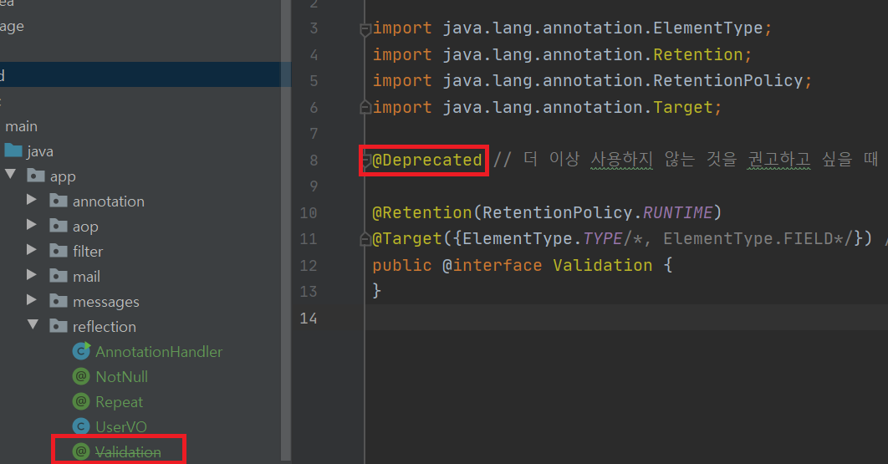
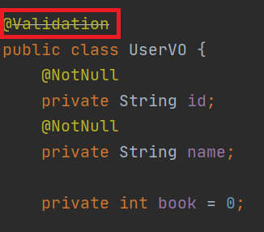

어노테이션이란?
-
* Java 5 부터 추가된 요소이다.
* @Override 는 오버라이딩 메소드를 표기하는 어노테이션의 일종
* 유효성 검사 등을 쉽게 할 수 있게 해주고, 관련 코드가 깔끔해지는 효과가 있음

메타데이터란?
-
* 데이터를 위한 데이터
* 즉, 데이터가 어떤 유형,속성인지 설명하기 위한 정보이다.

Java 기본 제공 어노테이션
-
* @FunctionalInterface
   - Java8 부터 지원하며, 함수형 인터페이스를 지정하는 어노테이션입니다.
   - 만약 메서드가 존재하지 않거나, 1개 이상의 메서드(default 메서드 제외)가 존재할 경우 컴파일 오류
* @Override
   - 선언한 메소드가 오버라이드 되었음을 의미
   - 부모 클래스에서 해당 메서드를 찾을 수 없다면 **컴파일에러**
* @Deprecated
   - 해당 메서드가 더 이상 사용되지 않음을 표시 (강제가 아닌 권고)
   - 사용할 경우 컴파일 경고 발생
   
   
* 커스텀 된 어노테이션 인터페이스에 @Deprecated 를 추가하니 밑줄이 생겼다.




어노테이션의 구성
-
```java
@Target(ElementType.FIELD)
@Retention(RetentionPolicy.RUNTIME)
public @interface NotNull {
}
```

* interface 앞에 @ 를 붙임으로써 어노테이션을 만들 수 있다.

@Target 어노테이션
-
어노테이션을 적용할 위치를 선택한다.

* ElementType.PACKAGE : 패키지 선언
* ElementType.TYPE : 타입 선언 (클래스 선언)
* ElementType.ANNOTATION_TYPE : 어노테이션 타입 선언
* ElementType.CONSTRUCTOR : 생성자 선언
* ElementType.FIELD : 멤버 변수 선언
* ElementType.LOCAL_VARIABLE : 지역 변수 선언
* ElementType.METHOD : 메서드 선언
* ElementType.PARAMETER : 전달인자 선언
* ElementType.TYPE_PARAMETER : 전달인자 타입 선언
* ElementType.TYPE_USE : 타입 선언

=> 괄호를 열어서 두가지 이상의 위치를 지정할 수 있다.  
=> 예를 들어 @Target({ElementType.TYPE, ElementType.FIELD}) 와 같이 지정 가능

@Retention 어노테이션
-
컴파일러가 어노테이션을 다루는 방법을 기술. 어느 시점에 영향을 미치게 할 것인지 결정한다.

* RetentionPolicy.SOURCE : 컴파일 전까지만 유효
* RetentionPolicy.CLASS : 컴파일러가 클래스를 참조할 때까지 유효.
* RetentionPolicy.RUNTIME : 컴파일 이후에도 JVM에 의해 계속 참조가 가능. (리플렉션 API 사용할 때 사용할 수 있게 됨)
   - 리플렉션이란 객체를 통해 클래스의 정보를 분석해 내는 프로그램 기법을 말한다.
   - Reflection API 를 통해 이전에는 불가능 했던 동적(컴파일 된 이후 시점에, 상황에 따라 다르게 생성함을 의미) 인스턴스 생성을 가능하게 해준다.

@Documented 어노테이션
-
어노테이션을 Javadoc에 포함

@Inherited 어노테이션
-
어노테이션의 상속을 가능하게 합니다.

@Repeatable 어노테이션
-
Java8 부터 지원, 연속적으로 어노테이션을 선언할 수 있게 해준다.

---

유효성 검사 어노테이션 & 메소드 반복 수 조절 하는 커스텀 메소드 제작하기 (Reflection API 이용)
-

[어노테이션핸들러를 실행해보세요](../src/main/java/app/reflection/AnnotationHandler.java "어노테이션핸들러를 실행해보세요")
