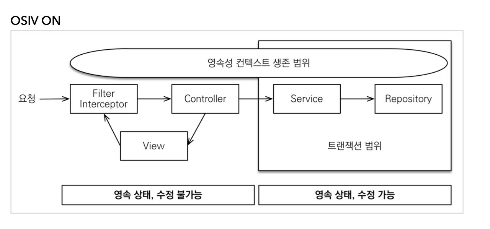
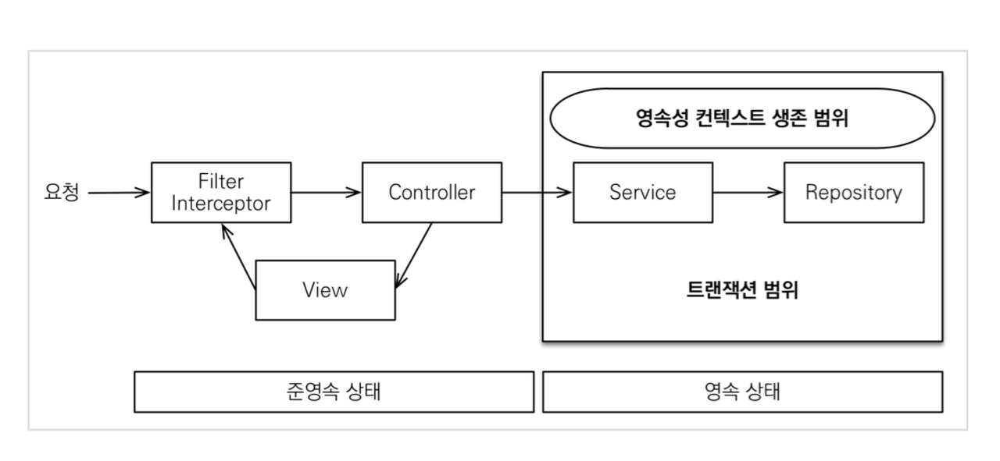

Open-In-View 
-
true일 경우

* 영속성(vo) 객체가 트랜잭션이 관리하는 범위를 넘어선 부분까지 살아 있는 것을 가능하게 해준다.
* 이는 EntityManager를 스레드에 등록하기 때문에 가능하다.
* transaction 범위를 넘어서는 레이어까지 살아있으면서 api 라면 클라이언트가 응답을 받을 때까지, view 라면 사용자 view 화면이 랜더링 될 때까지 영속성 컨텍스트가 살아있게 하는 것이다.
* DB Connection 을 계속 가지고 있는 상태이며, 이를 통해서 Lazy loading 을 가능하게 해준다.

false 일 경우

* 트랜잭션을 종료할 때 컨텍스트 또한 닫힌다.
* 고로 LazyLoading 을 할 수 없게 된다.

스프링부트에서 이 속성을 끄는 방법
-
* application.properties 에서 **spring.jpa.open-in-view=false** 추가하면 됌

코드를 통해 알아보려면 아래 링크를 참조하자
-
<https://gracelove91.tistory.com/100>

open in view에 대해 더 자세히 알아보려면 
-
<https://blog.kingbbode.com/27>
<https://woowacourse.github.io/javable/post/2020-09-11-osiv/>

트랜잭션과 open-in-view 속성
-
1. JPA 는 영속성(트랜젝션 범위가 벗어나도 자바 객체가 사라지지 않는)을 기본옵션으로 사용하고 있다. 이는 LazyLoading을 구현하기 위함이다.
2. 이는 스레드에 DB 커넥션을 관리하는 객체를 등록해서 DB 커넥션을 계속 잡아둠으로써 가능하게 함 
3. 스프링에서 DB 커넥션을 관리하는 객체는 SessionFactory 이지만, JPA에서는 EntityManager를 사용하고 JPA에서 스레드에 등록 가능한 객체도 SessionFactory가 아닌, EntityManager이다.
4. JPA는 기본적으로 영속성 특징을 가지고 있고 따라서 open-in-view는 true이며 이 상태에선 DB 커넥션을 위한 객체로 EntityManager을 사용할 수 밖에 없다.
5. 그래서 JPA에서 트랜젝션을 사용하면 SessionFactory 대신 EntityManager를 트랜젝션 어드바이스에 넘겨줄 수 밖에 없다.
5. 트랜젝션 어드바이스에서는 세션(DB 커넥션을 관리하는 객체)을 관리함으로 써 트랜젝션 처리를 하게 되는데 이때 세션을 관리하기 위해 SessionFactory 를 사용함
6. JPA 에서 open-in-view가 true이면 받은 객체는 EntityManager인데 사용해야하는 객체는 SessionFactory이니 캐스팅을 시도하고 타입이 맞지 않으니 에러가 남

