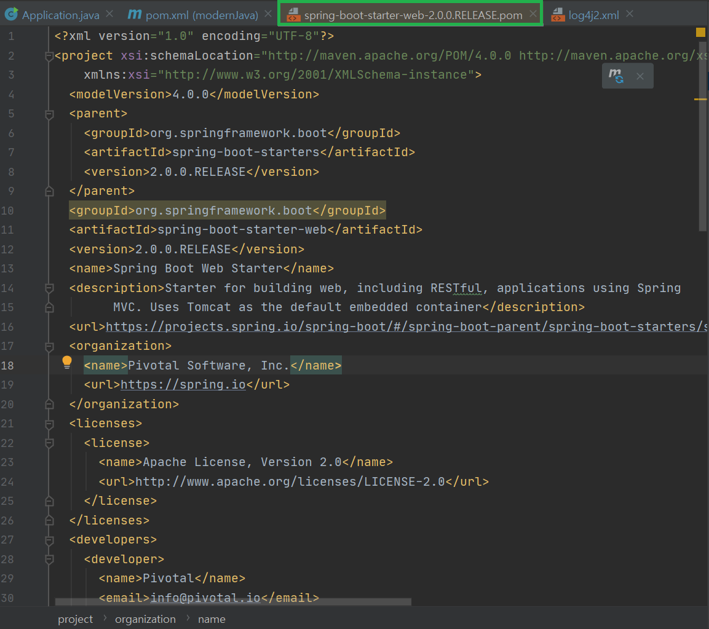
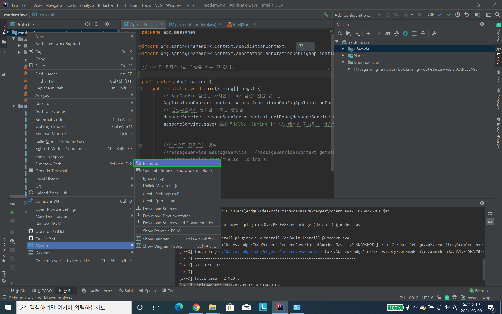
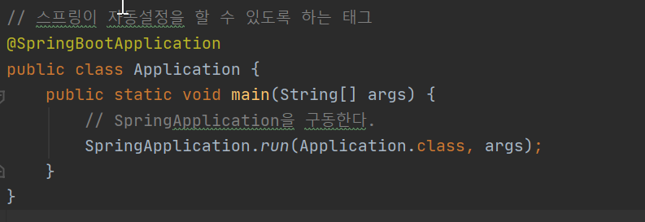
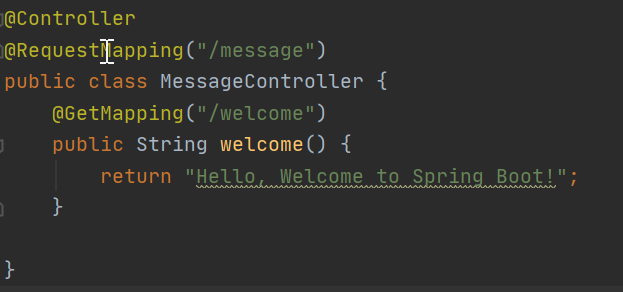

SpringBoot 시작
-
```html
<dependency>
    <groupId>org.springframework.boot</groupId>
    <artifactId>spring-boot-starter-web</artifactId>
</dependency>

<dependencies>
    <dependency>
        <groupId>org.springframework.boot</groupId>
        <artifactId>spring-boot-starter-web</artifactId>
    </dependency>
</dependencies>
```
위 코드를 추가한 뒤에 메이븐 install 하면 된다.


* pom.xml 의 수정사항은 idea 가 자동으로 다운받아 주긴 하지만, 기본적으로 직접 maven을 이용해서 설치 명령을 내릴 수도 있다.
* <parent> 태그는 부모의 스타터로부터 프로젝트 아티팩트를 상속받는다. 그리고 spring-boot-starter-web 의존성은 spring-context 모듈을 포함한다.


스프링 부트가 관리하고 있는 의존성들


스프링 프레임워크를 부트로 변경하면 다시 import 해줘야 한다.


스프링 부트 시작 


스프링 부트 컨트롤러 생성

```html
<plugins>
    <plugin>
        <groupId>org.springframework.boot</groupId>
        <artifactId>spring-boot-maven-plugin</artifactId>
    </plugin>
</plugins>
```
으로 플러그인을 변경해준다.


1. mvn spring-boot:run 으로 부트가 자동으로 어플리케이션 실행하도록 함
2. ctrl + c 로 어플 종료

---

# 어노테이션
 * @RequestBody
    - HTTP 요청 몸체(body)를 자바 객체로 변환해서 받을 수 있도록 함. @ResponseBody 는 HTTP 응답 객체로 만들어 반환을 하기 위함임
 * @ResponseBody 
    - 리턴 타입이 경로가 아닌, Stream을 타고 나갈 수 있도록 설정함. 원래는 HttpServletResponse 객체를 통해 얻은 스트림으로 해야하는 동작을 프레임워크단에서 처리해줌
    - 응답의 반환값을 본문으로 사용하는 효과를 줌
 * @RequestMapping
    - 요청을 컨트롤러가 받을 수 있도록 매핑을 생성해준다.
 * @Controller
    - 이 클래스가 컨트롤러임을 알린다. 
 * @GetMapping("url")
    - @RequestMapping(value="url", method=RequestMethod.GET) 의 축약형이다. post, delete, put 도 동일
 * @RestController
    - RESTful API 를 만들기 위해 사용하는 컨트롤러로 @Controller와 @ResponseBody의 조합이다.
 
 
 ---

html 템플릿 엔진 추가하기
-
 
 ```html
<!-- 정의한 HTML 템플릿 기반으로 HTML 코드 생성하는 템플릿 엔진을 추가 / 직접 라이브러리를 추가하는 것이 아닌 부트가 할 수 있도록 -->
<dependency>
 <groupId>org.springframework.boot</groupId>
 <artifactId>spring-boot-starter-thymeleaf</artifactId>
</dependency>
 ```
src/main/resources 밑에 디렉토리인 templates 추가 하면
Controller의 return 타입의 파일은 해당 디렉토리 안에서 찾는다.
---

ModelAndView 사용하기
```java
@GetMapping("/welcome")
public String welcome(Model model) {
    model.addAttribute("message", "Hello, Welcome to Spring Boot!");
    return "welcome";
}

@GetMapping("/welcome")
public ModelAndView welcome() {
    ModelAndView mv = new ModelAndView("welcome");
    mv.addObject("message", "Hello, Welcome to Spring Boot!");
    return mv;
}
```

위와 아래는 완전히 동일한 코드이다. 
스프링은 HTML 템플릿 엔진인
1. JSP (스프링 부트가 임베디드[컴퓨터 시스템에 내장하는] 서버로 실행이 될 때는 많은 제약이 있어서 jsp 사용을 피하는 것이 좋다.)
2. 그루비 마크업
3. 프리마커
4. 머스태시 
5. 밸로시티(추가작업 후 연동 가능)
등등 을 지원한다.

---


